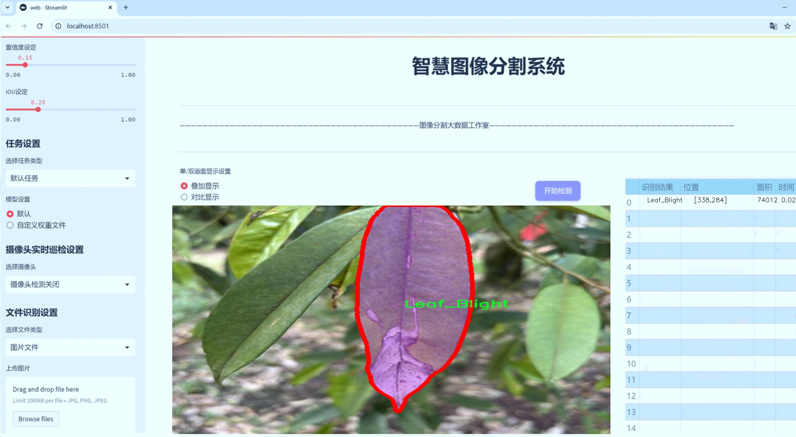
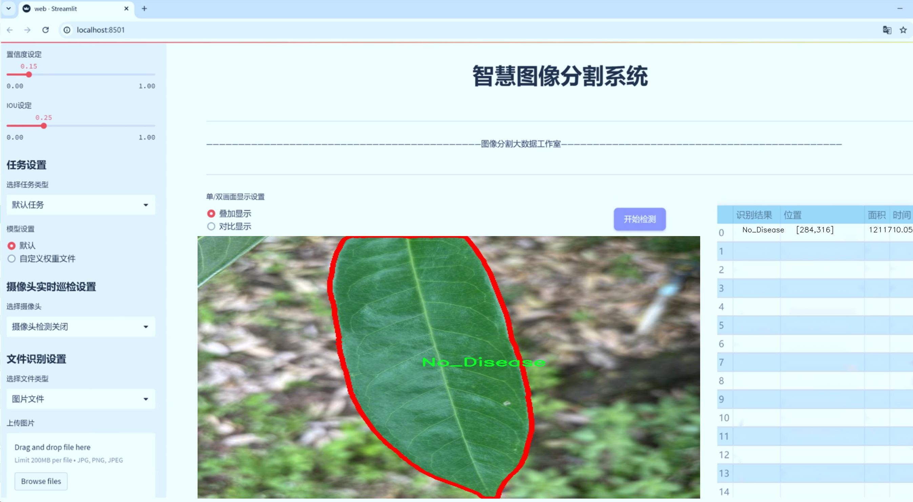
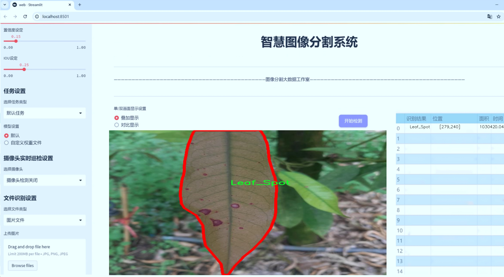
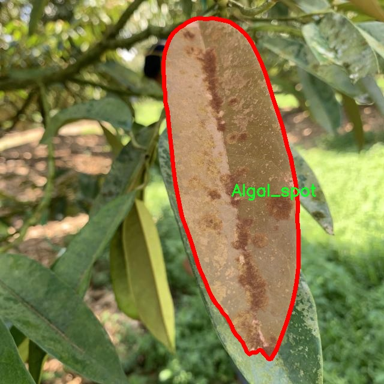
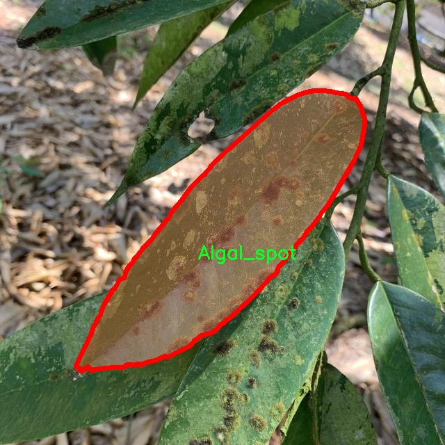
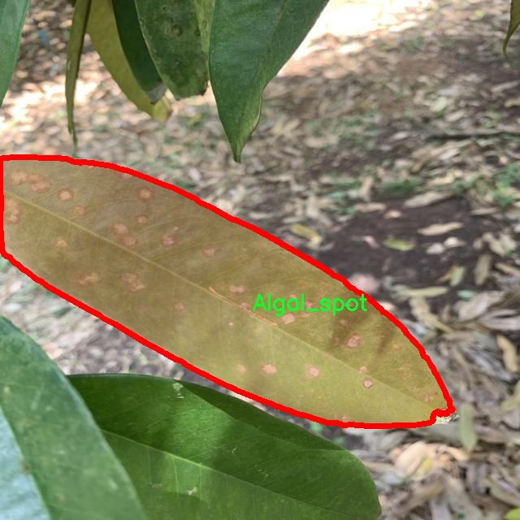
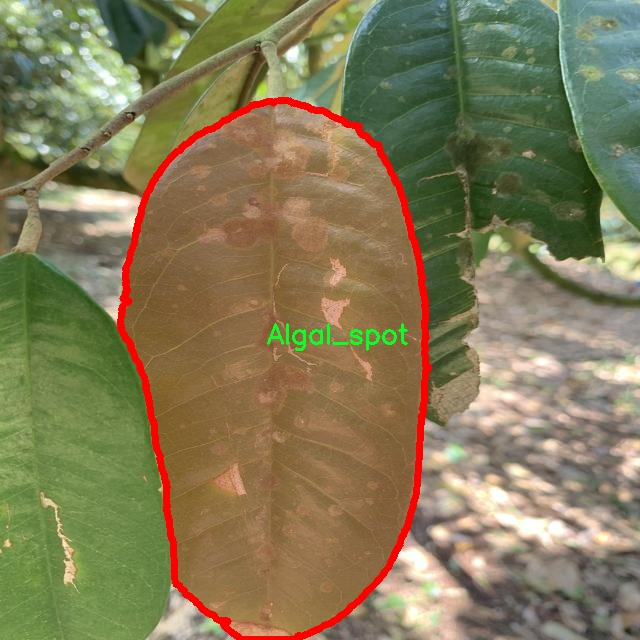
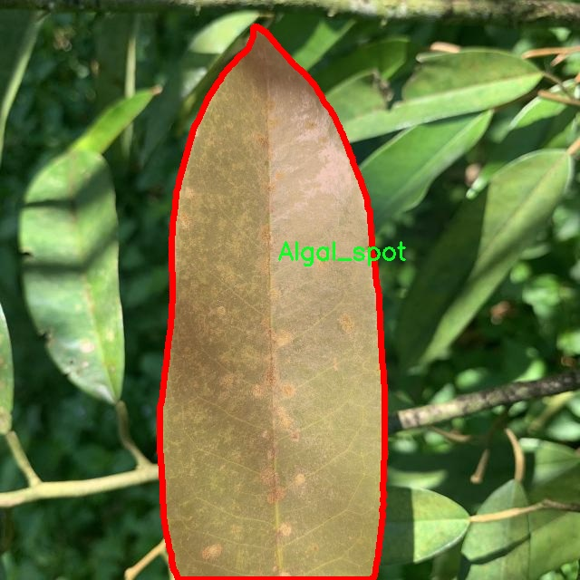

# 榴莲叶病害分割系统源码＆数据集分享
 [yolov8-seg-C2f-OREPA＆yolov8-seg-fasternet等50+全套改进创新点发刊_一键训练教程_Web前端展示]

### 1.研究背景与意义

项目参考[ILSVRC ImageNet Large Scale Visual Recognition Challenge](https://gitee.com/YOLOv8_YOLOv11_Segmentation_Studio/projects)

项目来源[AAAI Global Al lnnovation Contest](https://kdocs.cn/l/cszuIiCKVNis)

研究背景与意义

榴莲（Durio spp.）作为一种热带水果，因其独特的风味和丰富的营养价值而受到广泛喜爱。然而，榴莲的种植和生产过程中，病害的发生严重影响了其产量和品质，进而影响了农民的经济收益和市场供应。榴莲叶病害主要包括藻斑病（Algal spot）、叶枯病（Leaf blight）、叶斑病（Leaf spot）等，这些病害不仅导致叶片的损伤，还可能引发树体的衰弱，甚至导致整株植物的死亡。因此，及时、准确地识别和分割榴莲叶病害，对于病害的防治和榴莲的健康生长至关重要。

近年来，随着计算机视觉和深度学习技术的快速发展，基于图像处理的病害检测与识别方法逐渐成为研究热点。YOLO（You Only Look Once）系列模型因其高效的实时检测能力和较高的准确性，已被广泛应用于各类物体检测任务中。YOLOv8作为该系列的最新版本，进一步提升了模型的性能，特别是在小物体检测和复杂背景下的表现。因此，基于改进YOLOv8的榴莲叶病害分割系统的研究，不仅能够提高病害识别的准确性，还能为农业生产提供实时、智能的决策支持。

本研究所使用的数据集包含1400张榴莲叶片图像，涵盖了四类病害（藻斑病、叶枯病、叶斑病及无病害），为模型的训练和验证提供了丰富的样本。这一数据集的构建，旨在为榴莲叶病害的自动识别和分割提供基础数据支持，推动相关领域的研究进展。通过对不同病害特征的学习，改进YOLOv8模型能够有效提取叶片的细微特征，从而实现高精度的病害分割。这一过程不仅有助于提高病害检测的效率，还能为农民提供及时的病害预警，减少因病害导致的经济损失。

此外，榴莲叶病害的智能分割系统的建立，具有重要的实际应用意义。通过将该系统应用于榴莲种植的日常管理中，农民可以更早地发现病害，采取相应的防治措施，从而有效降低农药的使用量，推动可持续农业的发展。同时，该系统的成功应用也为其他作物的病害检测提供了借鉴，具有较高的推广价值。

综上所述，基于改进YOLOv8的榴莲叶病害分割系统的研究，不仅具有重要的理论意义，也为实际农业生产提供了切实可行的解决方案。通过这一研究，期望能够为榴莲产业的健康发展贡献力量，推动农业智能化的进程。

### 2.图片演示







##### 注意：由于此博客编辑较早，上面“2.图片演示”和“3.视频演示”展示的系统图片或者视频可能为老版本，新版本在老版本的基础上升级如下：（实际效果以升级的新版本为准）

  （1）适配了YOLOV8的“目标检测”模型和“实例分割”模型，通过加载相应的权重（.pt）文件即可自适应加载模型。

  （2）支持“图片识别”、“视频识别”、“摄像头实时识别”三种识别模式。

  （3）支持“图片识别”、“视频识别”、“摄像头实时识别”三种识别结果保存导出，解决手动导出（容易卡顿出现爆内存）存在的问题，识别完自动保存结果并导出到tempDir中。

  （4）支持Web前端系统中的标题、背景图等自定义修改，后面提供修改教程。

  另外本项目提供训练的数据集和训练教程,暂不提供权重文件（best.pt）,需要您按照教程进行训练后实现图片演示和Web前端界面演示的效果。

### 3.视频演示

[3.1 视频演示](https://www.bilibili.com/video/BV1VdyRYFEC7/)

### 4.数据集信息展示

##### 4.1 本项目数据集详细数据（类别数＆类别名）

nc: 4
names: ['Algal_spot', 'Leaf_Blight', 'Leaf_Spot', 'No_Disease']


##### 4.2 本项目数据集信息介绍

数据集信息展示

在榴莲种植业中，叶片病害的早期识别与处理至关重要，直接影响到作物的产量和品质。为此，我们构建了一个专门用于训练改进YOLOv8-seg的榴莲叶病害分割系统的数据集，命名为“durian_leaf_disease”。该数据集旨在为研究人员和农业从业者提供一个高效的工具，以便更好地识别和分类榴莲叶片上的病害，从而实现精准农业管理。

“durian_leaf_disease”数据集包含四个主要类别，分别是“Algal_spot”（藻斑）、“Leaf_Blight”（叶枯病）、“Leaf_Spot”（叶斑病）和“No_Disease”（无病害）。每个类别都代表了榴莲叶片上可能出现的不同病害类型，涵盖了从轻微病害到严重病害的多种情况。藻斑通常表现为叶片上出现的绿色或黑色斑点，主要由水分过多或通风不良引起；叶枯病则表现为叶片边缘变黄、干枯，严重时可能导致整片叶子枯死；叶斑病则通常呈现为不规则的褐色斑点，影响光合作用；而无病害类别则代表健康的榴莲叶片，为模型提供了对比基准。

数据集的构建过程经过精心设计，确保每个类别的样本数量均衡，便于模型在训练过程中学习到各类病害的特征。数据集中的图像来源于不同的榴莲种植园，涵盖了多种生长环境和气候条件，确保了数据的多样性和代表性。每张图像都经过标注，包含了病害的具体位置和类别信息，这为YOLOv8-seg模型的训练提供了必要的监督信号。

在数据集的使用过程中，研究人员可以利用该数据集进行模型的训练、验证和测试。通过对比不同模型在该数据集上的表现，可以评估改进YOLOv8-seg在榴莲叶病害分割任务中的有效性。模型的训练过程将涉及多种数据增强技术，以提高模型的泛化能力，确保其在实际应用中的鲁棒性。

此外，数据集的设计还考虑到了实际应用中的需求，旨在为农民和农业专家提供一个易于使用的工具，帮助他们快速识别和处理榴莲叶片病害。通过结合计算机视觉技术和深度学习算法，该系统能够在短时间内处理大量图像数据，提供准确的病害分类结果，从而为榴莲种植的管理决策提供科学依据。

总之，“durian_leaf_disease”数据集不仅为改进YOLOv8-seg的榴莲叶病害分割系统提供了坚实的基础，也为未来的研究和应用奠定了良好的基础。随着数据集的不断扩展和模型的持续优化，我们期待能够在榴莲种植领域实现更高效的病害监测与管理，为可持续农业发展贡献力量。











### 5.全套项目环境部署视频教程（零基础手把手教学）

[5.1 环境部署教程链接（零基础手把手教学）](https://www.bilibili.com/video/BV1jG4Ve4E9t/?vd_source=bc9aec86d164b67a7004b996143742dc)


[5.2 安装Python虚拟环境创建和依赖库安装视频教程链接（零基础手把手教学）](https://www.bilibili.com/video/BV1nA4VeYEze/?vd_source=bc9aec86d164b67a7004b996143742dc)

### 6.手把手YOLOV8-seg训练视频教程（零基础小白有手就能学会）

[6.1 手把手YOLOV8-seg训练视频教程（零基础小白有手就能学会）](https://www.bilibili.com/video/BV1cA4VeYETe/?vd_source=bc9aec86d164b67a7004b996143742dc)


按照上面的训练视频教程链接加载项目提供的数据集，运行train.py即可开始训练



     Epoch   gpu_mem       box       obj       cls    labels  img_size
     1/200     0G   0.01576   0.01955  0.007536        22      1280: 100%|██████████| 849/849 [14:42<00:00,  1.04s/it]
               Class     Images     Labels          P          R     mAP@.5 mAP@.5:.95: 100%|██████████| 213/213 [01:14<00:00,  2.87it/s]
                 all       3395      17314      0.994      0.957      0.0957      0.0843

     Epoch   gpu_mem       box       obj       cls    labels  img_size
     2/200     0G   0.01578   0.01923  0.007006        22      1280: 100%|██████████| 849/849 [14:44<00:00,  1.04s/it]
               Class     Images     Labels          P          R     mAP@.5 mAP@.5:.95: 100%|██████████| 213/213 [01:12<00:00,  2.95it/s]
                 all       3395      17314      0.996      0.956      0.0957      0.0845

     Epoch   gpu_mem       box       obj       cls    labels  img_size
     3/200     0G   0.01561    0.0191  0.006895        27      1280: 100%|██████████| 849/849 [10:56<00:00,  1.29it/s]
               Class     Images     Labels          P          R     mAP@.5 mAP@.5:.95: 100%|███████   | 187/213 [00:52<00:00,  4.04it/s]
                 all       3395      17314      0.996      0.957      0.0957      0.0845


### 7.50+种全套YOLOV8-seg创新点代码加载调参视频教程（一键加载写好的改进模型的配置文件）

[7.1 50+种全套YOLOV8-seg创新点代码加载调参视频教程（一键加载写好的改进模型的配置文件）](https://www.bilibili.com/video/BV1Hw4VePEXv/?vd_source=bc9aec86d164b67a7004b996143742dc)

### 8.YOLOV8-seg图像分割算法原理

原始YOLOv8-seg算法原理

YOLOv8-seg算法是基于YOLOv8目标检测框架的一个重要扩展，旨在实现更为精细的图像分割任务。该算法在YOLOv8的基础上，融合了图像分割的需求，通过对目标的精确轮廓进行提取，提升了目标检测的精度和适用性。YOLOv8-seg的核心思想是通过改进的卷积神经网络结构，结合多种新技术，以实现高效、准确的目标分割。

首先，YOLOv8-seg采用了更深的卷积神经网络结构，这使得模型能够提取更丰富的特征信息。与传统的目标检测方法不同，YOLOv8-seg不再依赖滑动窗口或区域提议，而是将整个图像作为输入，直接在图像上进行目标检测和分割。这种端到端的处理方式显著提高了检测的速度和精度，尤其是在复杂场景下的表现。

在YOLOv8-seg中，特征提取网络被设计为一个多层次的结构，利用特征金字塔网络（FPN）和路径聚合网络（PAN）进行特征融合。FPN能够有效地从不同尺度的特征图中提取信息，而PAN则通过增强特征的传递和融合，进一步提升了模型对小目标的检测能力。这种多尺度特征的处理方式使得YOLOv8-seg在处理不同大小的目标时，能够保持较高的精度。

此外，YOLOv8-seg还引入了轻量化的C2F模块，替代了传统的C3模块，以减少计算复杂度和内存占用。C2F模块通过优化卷积操作，能够在保持模型性能的同时，显著提升推理速度。这一设计使得YOLOv8-seg不仅适用于高性能的计算平台，也能够在资源受限的环境中高效运行。

YOLOv8-seg的检测头结构也进行了创新，采用了解耦头的设计。与传统的耦合头不同，解耦头能够独立处理不同的检测任务，如目标分类和边界框回归，从而提高了模型的灵活性和准确性。这种设计使得YOLOv8-seg在处理复杂场景时，能够更好地适应不同的目标特征，提高了分割的精度。

在训练过程中，YOLOv8-seg采用了多尺度训练和测试的策略。这一策略不仅提高了模型的鲁棒性，还增强了模型对不同输入尺寸的适应能力。通过在多个尺度上进行训练，YOLOv8-seg能够更好地捕捉到目标的细节信息，从而在分割任务中表现出色。

YOLOv8-seg还具有较强的可扩展性，支持自定义数据集的训练。这一特性使得用户能够根据具体应用场景，灵活调整模型参数和结构，以满足不同的需求。例如，在智能监控、自动驾驶等领域，YOLOv8-seg能够根据特定的目标类型和环境条件，进行针对性的优化，从而提升检测和分割的效果。

总的来说，YOLOv8-seg算法通过对YOLOv8的深度优化和扩展，成功实现了高效的目标检测与分割。其创新的网络结构、多尺度特征处理、轻量化设计以及解耦头的应用，使得YOLOv8-seg在各种复杂场景下均能展现出卓越的性能。这一算法的提出，不仅为目标检测领域带来了新的思路，也为图像分割任务的研究提供了有力的工具，具有广泛的应用前景。随着技术的不断进步，YOLOv8-seg有望在更多实际应用中发挥重要作用，推动智能视觉技术的发展。


### 9.系统功能展示（检测对象为举例，实际内容以本项目数据集为准）

图9.1.系统支持检测结果表格显示

  图9.2.系统支持置信度和IOU阈值手动调节

  图9.3.系统支持自定义加载权重文件best.pt(需要你通过步骤5中训练获得)

  图9.4.系统支持摄像头实时识别

  图9.5.系统支持图片识别

  图9.6.系统支持视频识别

  图9.7.系统支持识别结果文件自动保存

  图9.8.系统支持Excel导出检测结果数据


### 10.50+种全套YOLOV8-seg创新点原理讲解（非科班也可以轻松写刊发刊，V11版本正在科研待更新）

#### 10.1 由于篇幅限制，每个创新点的具体原理讲解就不一一展开，具体见下列网址中的创新点对应子项目的技术原理博客网址【Blog】：


[10.1 50+种全套YOLOV8-seg创新点原理讲解链接](https://gitee.com/qunmasj/good)

#### 10.2 部分改进模块原理讲解(完整的改进原理见上图和技术博客链接)【如果此小节的图加载失败可以通过CSDN或者Github搜索该博客的标题访问原始博客，原始博客图片显示正常】
### YOLOv8简介
目前YOLO系列的SOTA模型是ultralytics公司于2023年发布的YOLOv8.按照模型宽度和深度不同分为YOLOv8n、YOLOv8s、YOLOv8m、YOLOv81、YOLOv8x五个版本。本文改进的是 YOLOv8n模型。
YOLOv8的 Backbone采用CSPDarknet结构，它是 Darknet 的一种改进，引入CSP改善网络结构。CSPDarknet把特征图分为两部分，一部分进行卷积操作，另一部分进行跳跃连接，在保持网络深度的同时减少参数量和计算量，提高网络效率。Neck 部分采用特征金字塔PANet[17]，通过自顶向下路径结合和自底向上特征传播进行多尺度融合。损失函数采用了CIloU[18]。YOLOv8的网络结构如图所示。


### ParC融合位置感知循环卷积简介
ParC：Position aware circular convolution


#### Position aware circular convolution
针对于全局信息的提取作者提出了Position aware circular convolution（也称作Global Circular Convolution）。图中左右实际是对于该操作水平竖直两方向的对称，理解时只看左边即可。对于维度为C*H*W的输入，作者先将维度为C*B*1的Position Embedding通过双线性插值函数F调整到适合input的维度C*H*1（以适应不同特征大小输入），并且将PE水平复制扩展到C*H*W维度与输入特征相加。这里作者将PE直接设置成为了可学习的参数。

接下来参考该博客将加入PE的特征图竖直方向堆叠，并且同样以插值的方式得到了适应输入维度的C*H*1大小的卷积核，进行卷积操作。对于这一步卷积，作者将之称为循环卷积，并给出了一个卷积示意图。


但个人感觉实际上这个示意图只是为了说明为什么叫循环卷积，对于具体的计算细节还是根据公式理解更好。


进一步，作者给出了这一步的伪代码来便于读者对这一卷积的理解：y=F.conv2D（torch.cat（xp，xp，dim=2），kV），实际上就是将xp堆叠之后使用了一个“条形（或柱形）”卷积核进行简单的卷积操作。（但这样会导致多一次重复卷积，因此在堆叠示意图中只取了前2*H-1行）

可以看到在示意图中特征维度变化如下：C*(2H-1)*W ---C*H*1--->C*H*W，作者特意带上了通道数，并且并没有出现通道数的改变，那么这里所进行的卷积应该是depth wise卷积，通过对文章后续以及论文源码的阅读可以得知这一步进行的就是DW卷积。（we introduce group convolution and point wise convolution into these modules, which decreases number of parameters without hurting performance.）


由groups = channel可知使用的是DW卷积
通过上面就完成了一次竖直方向的全局信息交流，同样只要在水平方向进行同样的操作即可做到水平方向的全局信息交流。

#### ParC block

通过ParC成功解决了全局信息提取的问题，接下来就是针对2）3）两点进行改进。首先是Meta-Former模块，Meta-Former由Token Mixer和Channel Mixer构成，ParC首先满足了Token Mixer的全局信息提取的要求，并且相较于Attention在计算成本上更低。


这里①中的PWC即point wise conv，进一步验证了我们前面对于深度可分离卷积的想法，而GCC-H/V即是前面所说的ParC-H/V。

①构建了Meta-Former中的Token mixer模块，那么最后剩下的问题就是3），替换掉Attention模块之后模型不再data driven。为了解决这一点作者给出了一个channel wise attention，先将特征图（x,C*H*W）进行global average（a,C*1*1）并输入一个MLP生成一个channel wise的权重（w,C*1*1），再将权重与特征图在通道方向相乘得到输出（output = wx,C*H*W）。

#### ParC net
对于ParC net 的搭建，作者直接基于MobileViT，采用了分叉结构（c）完成了网络的搭建。


具体而言作者保留了MobileViT中浅层具有局部感受野的MobileNetV2结构，而将网络深层的ViT block替换成了ParC block，使网络变成了一个pure ConvNet。


### 11.项目核心源码讲解（再也不用担心看不懂代码逻辑）

#### 11.1 ui.py

以下是对代码的核心部分进行提炼和详细注释的版本：

```python
import sys  # 导入系统模块，用于获取Python解释器的路径
import subprocess  # 导入子进程模块，用于执行外部命令
from QtFusion.path import abs_path  # 从QtFusion模块导入abs_path函数，用于获取绝对路径

def run_script(script_path):
    """
    使用当前 Python 环境运行指定的脚本。

    Args:
        script_path (str): 要运行的脚本路径

    Returns:
        None
    """
    # 获取当前 Python 解释器的路径
    python_path = sys.executable

    # 构建运行命令，使用streamlit运行指定的脚本
    command = f'"{python_path}" -m streamlit run "{script_path}"'

    # 执行命令
    result = subprocess.run(command, shell=True)  # 使用subprocess.run执行命令
    if result.returncode != 0:  # 检查命令执行结果
        print("脚本运行出错。")  # 如果返回码不为0，输出错误信息

# 实例化并运行应用
if __name__ == "__main__":
    # 指定要运行的脚本路径，使用abs_path获取绝对路径
    script_path = abs_path("web.py")

    # 运行指定的脚本
    run_script(script_path)
```

### 代码核心部分分析
1. **模块导入**：
   - `sys`模块用于获取当前Python解释器的路径。
   - `subprocess`模块用于执行外部命令。
   - `abs_path`函数用于将相对路径转换为绝对路径。

2. **`run_script`函数**：
   - 该函数接受一个脚本路径作为参数，并使用当前Python环境运行该脚本。
   - 首先获取当前Python解释器的路径，然后构建运行命令。
   - 使用`subprocess.run`执行命令，并检查返回码以确定脚本是否成功运行。

3. **主程序块**：
   - 在`__main__`块中，指定要运行的脚本路径，并调用`run_script`函数执行该脚本。

### 主要功能
该代码的主要功能是通过当前Python环境运行一个指定的脚本（在本例中为`web.py`），并处理可能出现的错误。

这个程序文件 `ui.py` 的主要功能是运行一个指定的 Python 脚本，具体来说是使用 Streamlit 框架来启动一个 Web 应用。程序的实现过程如下：

首先，文件导入了几个必要的模块，包括 `sys`、`os` 和 `subprocess`。其中，`sys` 模块用于访问与 Python 解释器相关的变量和函数，`os` 模块提供了与操作系统交互的功能，而 `subprocess` 模块则用于执行外部命令。

接着，程序从 `QtFusion.path` 模块中导入了 `abs_path` 函数，这个函数的作用是获取给定路径的绝对路径，确保在运行脚本时能够找到正确的文件位置。

程序定义了一个名为 `run_script` 的函数，该函数接受一个参数 `script_path`，表示要运行的脚本的路径。在函数内部，首先获取当前 Python 解释器的路径，这通过 `sys.executable` 实现。然后，构建一个命令字符串，该命令使用当前的 Python 解释器来运行指定的脚本，具体是通过 `streamlit run` 命令来启动 Streamlit 应用。

接下来，使用 `subprocess.run` 方法执行构建好的命令。如果命令执行的返回码不为零，表示脚本运行出错，程序会输出一条错误信息。

在文件的最后部分，程序通过 `if __name__ == "__main__":` 语句来判断是否是直接运行该文件。如果是，则指定要运行的脚本路径，这里使用 `abs_path` 函数获取 `web.py` 的绝对路径。最后，调用 `run_script` 函数来执行这个脚本。

总体来说，这个程序的核心功能是通过 Streamlit 启动一个 Web 应用，并且提供了基本的错误处理机制，以确保在脚本运行失败时能够给出提示。

#### 11.2 ultralytics\utils\tal.py

以下是经过简化和注释的核心代码部分，主要包括`TaskAlignedAssigner`类及其相关方法。这个类用于在目标检测中根据任务对齐的指标将真实目标（ground truth）分配给锚框（anchors）。

```python
import torch
import torch.nn as nn

def select_candidates_in_gts(xy_centers, gt_bboxes, eps=1e-9):
    """
    选择在真实框（gt）中正样本的锚框中心。

    参数:
        xy_centers (Tensor): 形状为(h*w, 2)的张量，表示锚框中心坐标。
        gt_bboxes (Tensor): 形状为(b, n_boxes, 4)的张量，表示真实框的坐标。

    返回:
        (Tensor): 形状为(b, n_boxes, h*w)的张量，表示哪些锚框中心在真实框内。
    """
    n_anchors = xy_centers.shape[0]
    bs, n_boxes, _ = gt_bboxes.shape
    lt, rb = gt_bboxes.view(-1, 1, 4).chunk(2, 2)  # 左上角和右下角坐标
    bbox_deltas = torch.cat((xy_centers[None] - lt, rb - xy_centers[None]), dim=2).view(bs, n_boxes, n_anchors, -1)
    return bbox_deltas.amin(3).gt_(eps)  # 返回最小值大于eps的布尔值

class TaskAlignedAssigner(nn.Module):
    """
    任务对齐分配器，用于目标检测。

    属性:
        topk (int): 考虑的候选框数量。
        num_classes (int): 目标类别数量。
        alpha (float): 分类组件的alpha参数。
        beta (float): 定位组件的beta参数。
        eps (float): 防止除以零的小值。
    """

    def __init__(self, topk=13, num_classes=80, alpha=1.0, beta=6.0, eps=1e-9):
        """初始化任务对齐分配器对象，设置超参数。"""
        super().__init__()
        self.topk = topk
        self.num_classes = num_classes
        self.bg_idx = num_classes  # 背景类别索引
        self.alpha = alpha
        self.beta = beta
        self.eps = eps

    @torch.no_grad()
    def forward(self, pd_scores, pd_bboxes, anc_points, gt_labels, gt_bboxes, mask_gt):
        """
        计算任务对齐分配。

        参数:
            pd_scores (Tensor): 形状为(bs, num_total_anchors, num_classes)的张量，表示预测得分。
            pd_bboxes (Tensor): 形状为(bs, num_total_anchors, 4)的张量，表示预测框。
            anc_points (Tensor): 形状为(num_total_anchors, 2)的张量，表示锚框中心。
            gt_labels (Tensor): 形状为(bs, n_max_boxes, 1)的张量，表示真实框标签。
            gt_bboxes (Tensor): 形状为(bs, n_max_boxes, 4)的张量，表示真实框坐标。
            mask_gt (Tensor): 形状为(bs, n_max_boxes, 1)的张量，表示有效的真实框。

        返回:
            target_labels (Tensor): 形状为(bs, num_total_anchors)的张量，包含目标标签。
            target_bboxes (Tensor): 形状为(bs, num_total_anchors, 4)的张量，包含目标框。
            target_scores (Tensor): 形状为(bs, num_total_anchors, num_classes)的张量，包含目标得分。
            fg_mask (Tensor): 形状为(bs, num_total_anchors)的布尔张量，表示正样本锚框。
            target_gt_idx (Tensor): 形状为(bs, num_total_anchors)的张量，表示分配的真实框索引。
        """
        self.bs = pd_scores.size(0)
        self.n_max_boxes = gt_bboxes.size(1)

        if self.n_max_boxes == 0:
            device = gt_bboxes.device
            return (torch.full_like(pd_scores[..., 0], self.bg_idx).to(device), 
                    torch.zeros_like(pd_bboxes).to(device),
                    torch.zeros_like(pd_scores).to(device), 
                    torch.zeros_like(pd_scores[..., 0]).to(device),
                    torch.zeros_like(pd_scores[..., 0]).to(device))

        # 获取正样本掩码和对齐指标
        mask_pos, align_metric, overlaps = self.get_pos_mask(pd_scores, pd_bboxes, gt_labels, gt_bboxes, anc_points, mask_gt)

        # 选择重叠度最高的真实框
        target_gt_idx, fg_mask, mask_pos = select_highest_overlaps(mask_pos, overlaps, self.n_max_boxes)

        # 获取目标标签、框和得分
        target_labels, target_bboxes, target_scores = self.get_targets(gt_labels, gt_bboxes, target_gt_idx, fg_mask)

        # 归一化对齐指标
        align_metric *= mask_pos
        pos_align_metrics = align_metric.amax(dim=-1, keepdim=True)  # 计算每个正样本的最大对齐指标
        pos_overlaps = (overlaps * mask_pos).amax(dim=-1, keepdim=True)  # 计算每个正样本的最大重叠度
        norm_align_metric = (align_metric * pos_overlaps / (pos_align_metrics + self.eps)).amax(-2).unsqueeze(-1)
        target_scores = target_scores * norm_align_metric  # 更新目标得分

        return target_labels, target_bboxes, target_scores, fg_mask.bool(), target_gt_idx

    def get_pos_mask(self, pd_scores, pd_bboxes, gt_labels, gt_bboxes, anc_points, mask_gt):
        """获取正样本掩码。"""
        mask_in_gts = select_candidates_in_gts(anc_points, gt_bboxes)  # 获取在真实框内的锚框
        align_metric, overlaps = self.get_box_metrics(pd_scores, pd_bboxes, gt_labels, gt_bboxes, mask_in_gts * mask_gt)  # 计算对齐指标和重叠度
        mask_topk = self.select_topk_candidates(align_metric, topk_mask=mask_gt.expand(-1, -1, self.topk).bool())  # 选择top-k候选框
        mask_pos = mask_topk * mask_in_gts * mask_gt  # 合并掩码

        return mask_pos, align_metric, overlaps

    def get_box_metrics(self, pd_scores, pd_bboxes, gt_labels, gt_bboxes, mask_gt):
        """计算对齐指标和重叠度。"""
        na = pd_bboxes.shape[-2]
        mask_gt = mask_gt.bool()  # 转换为布尔类型
        overlaps = torch.zeros([self.bs, self.n_max_boxes, na], dtype=pd_bboxes.dtype, device=pd_bboxes.device)
        bbox_scores = torch.zeros([self.bs, self.n_max_boxes, na], dtype=pd_scores.dtype, device=pd_scores.device)

        ind = torch.zeros([2, self.bs, self.n_max_boxes], dtype=torch.long)  # 2, b, max_num_obj
        ind[0] = torch.arange(end=self.bs).view(-1, 1).expand(-1, self.n_max_boxes)  # b, max_num_obj
        ind[1] = gt_labels.squeeze(-1)  # b, max_num_obj
        bbox_scores[mask_gt] = pd_scores[ind[0], :, ind[1]][mask_gt]  # 获取每个锚框的得分

        # 计算重叠度
        pd_boxes = pd_bboxes.unsqueeze(1).expand(-1, self.n_max_boxes, -1, -1)[mask_gt]
        gt_boxes = gt_bboxes.unsqueeze(2).expand(-1, -1, na, -1)[mask_gt]
        overlaps[mask_gt] = bbox_iou(gt_boxes, pd_boxes, xywh=False, CIoU=True).squeeze(-1).clamp_(0)  # 计算IoU

        align_metric = bbox_scores.pow(self.alpha) * overlaps.pow(self.beta)  # 计算对齐指标
        return align_metric, overlaps

    def get_targets(self, gt_labels, gt_bboxes, target_gt_idx, fg_mask):
        """
        计算目标标签、目标框和目标得分。

        参数:
            gt_labels (Tensor): 真实框标签。
            gt_bboxes (Tensor): 真实框坐标。
            target_gt_idx (Tensor): 分配的真实框索引。
            fg_mask (Tensor): 正样本掩码。

        返回:
            (Tuple[Tensor, Tensor, Tensor]): 包含目标标签、目标框和目标得分的元组。
        """
        batch_ind = torch.arange(end=self.bs, dtype=torch.int64, device=gt_labels.device)[..., None]
        target_gt_idx = target_gt_idx + batch_ind * self.n_max_boxes  # 更新索引
        target_labels = gt_labels.long().flatten()[target_gt_idx]  # 获取目标标签

        target_bboxes = gt_bboxes.view(-1, 4)[target_gt_idx]  # 获取目标框
        target_labels.clamp_(0)  # 限制标签范围

        # 计算目标得分
        target_scores = torch.zeros((target_labels.shape[0], target_labels.shape[1], self.num_classes),
                                    dtype=torch.int64,
                                    device=target_labels.device)  # 初始化目标得分
        target_scores.scatter_(2, target_labels.unsqueeze(-1), 1)  # 将标签对应位置设为1

        fg_scores_mask = fg_mask[:, :, None].repeat(1, 1, self.num_classes)  # 扩展掩码
        target_scores = torch.where(fg_scores_mask > 0, target_scores, 0)  # 仅保留正样本得分

        return target_labels, target_bboxes, target_scores
```

### 代码说明
1. **选择候选框**：`select_candidates_in_gts`函数用于判断锚框中心是否在真实框内，返回布尔值。
2. **任务对齐分配器**：`TaskAlignedAssigner`类负责将真实框分配给锚框，计算对齐指标和重叠度。
3. **前向传播**：`forward`方法计算分配结果，包括目标标签、框和得分。
4. **获取正样本掩码**：`get_pos_mask`方法获取正样本的掩码，结合对齐指标和重叠度。
5. **计算对齐指标**：`get_box_metrics`方法计算每个锚框的得分和与真实框的重叠度。
6. **获取目标信息**：`get_targets`方法根据分配的真实框索引获取目标标签、框和得分。

这个程序文件是Ultralytics YOLO模型中的一个模块，主要用于目标检测中的任务对齐分配（Task-Aligned Assignment）。它的主要功能是将真实目标（ground truth）与锚框（anchor boxes）进行匹配，以便于后续的训练和推理。

首先，文件导入了必要的库，包括PyTorch和一些自定义的模块，如版本检查和指标计算。接着，定义了一个常量`TORCH_1_10`，用于检查当前PyTorch版本是否为1.10.0。

文件中包含多个函数和一个类。`select_candidates_in_gts`函数用于选择在真实目标框内的锚框中心，返回一个布尔张量，指示哪些锚框是有效的。`select_highest_overlaps`函数则用于处理当一个锚框被多个真实目标框分配时，选择与其重叠度最高的目标框。

`TaskAlignedAssigner`类是核心部分，它继承自`nn.Module`，用于实现任务对齐的分配逻辑。类的构造函数接受多个参数，包括考虑的锚框数量、类别数量以及用于分类和定位的超参数。`forward`方法是该类的主要接口，接收预测分数、预测框、锚点、真实标签和真实框等信息，计算出目标标签、目标框、目标分数等。

在`forward`方法中，首先处理了没有真实目标的情况。接着，通过调用`get_pos_mask`方法获取有效的锚框掩码和对齐指标，然后通过`select_highest_overlaps`选择重叠度最高的目标框。最后，计算目标标签、目标框和目标分数，并进行归一化处理。

`get_pos_mask`方法负责获取在真实目标框内的锚框掩码，并计算对齐指标和重叠度。`get_box_metrics`方法则用于计算预测框与真实框之间的对齐指标。`select_topk_candidates`方法用于选择前K个候选框，确保每个真实目标框只分配给一个锚框。

`get_targets`方法计算正锚框的目标标签、目标框和目标分数。最后，文件还定义了一些辅助函数，如`make_anchors`用于生成锚框，`dist2bbox`和`bbox2dist`用于在不同的框表示之间进行转换。

整体来看，这个模块通过对锚框和真实目标框的有效匹配，帮助提高目标检测模型的性能，确保模型能够准确地学习到目标的特征。

#### 11.3 ultralytics\nn\backbone\SwinTransformer.py

以下是经过简化并添加详细中文注释的核心代码部分：

```python
import torch
import torch.nn as nn
import torch.nn.functional as F
from timm.models.layers import DropPath, to_2tuple, trunc_normal_

class Mlp(nn.Module):
    """ 多层感知机（MLP）模块 """

    def __init__(self, in_features, hidden_features=None, out_features=None, act_layer=nn.GELU, drop=0.):
        super().__init__()
        out_features = out_features or in_features  # 输出特征数默认为输入特征数
        hidden_features = hidden_features or in_features  # 隐藏层特征数默认为输入特征数
        self.fc1 = nn.Linear(in_features, hidden_features)  # 第一层线性变换
        self.act = act_layer()  # 激活函数
        self.fc2 = nn.Linear(hidden_features, out_features)  # 第二层线性变换
        self.drop = nn.Dropout(drop)  # Dropout层

    def forward(self, x):
        """ 前向传播 """
        x = self.fc1(x)  # 线性变换
        x = self.act(x)  # 激活
        x = self.drop(x)  # Dropout
        x = self.fc2(x)  # 线性变换
        x = self.drop(x)  # Dropout
        return x


class WindowAttention(nn.Module):
    """ 基于窗口的多头自注意力模块 """

    def __init__(self, dim, window_size, num_heads, qkv_bias=True, attn_drop=0., proj_drop=0.):
        super().__init__()
        self.dim = dim  # 输入通道数
        self.window_size = window_size  # 窗口大小
        self.num_heads = num_heads  # 注意力头数
        head_dim = dim // num_heads  # 每个头的维度
        self.scale = head_dim ** -0.5  # 缩放因子

        # 相对位置偏置参数表
        self.relative_position_bias_table = nn.Parameter(
            torch.zeros((2 * window_size[0] - 1) * (2 * window_size[1] - 1), num_heads))

        # 计算相对位置索引
        coords_h = torch.arange(self.window_size[0])
        coords_w = torch.arange(self.window_size[1])
        coords = torch.stack(torch.meshgrid([coords_h, coords_w]))  # 生成坐标网格
        coords_flatten = torch.flatten(coords, 1)  # 展平坐标
        relative_coords = coords_flatten[:, :, None] - coords_flatten[:, None, :]  # 计算相对坐标
        relative_coords = relative_coords.permute(1, 2, 0).contiguous()  # 调整维度
        relative_coords[:, :, 0] += self.window_size[0] - 1  # 坐标偏移
        relative_coords[:, :, 1] += self.window_size[1] - 1
        relative_coords[:, :, 0] *= 2 * self.window_size[1] - 1
        relative_position_index = relative_coords.sum(-1)  # 计算相对位置索引
        self.register_buffer("relative_position_index", relative_position_index)  # 注册为缓冲区

        self.qkv = nn.Linear(dim, dim * 3, bias=qkv_bias)  # 线性变换生成Q、K、V
        self.attn_drop = nn.Dropout(attn_drop)  # 注意力权重的Dropout
        self.proj = nn.Linear(dim, dim)  # 输出线性变换
        self.proj_drop = nn.Dropout(proj_drop)  # 输出的Dropout
        trunc_normal_(self.relative_position_bias_table, std=.02)  # 初始化相对位置偏置
        self.softmax = nn.Softmax(dim=-1)  # Softmax层

    def forward(self, x, mask=None):
        """ 前向传播 """
        B_, N, C = x.shape  # 获取输入的形状
        qkv = self.qkv(x).reshape(B_, N, 3, self.num_heads, C // self.num_heads).permute(2, 0, 3, 1, 4)  # 计算Q、K、V
        q, k, v = qkv[0], qkv[1], qkv[2]  # 分离Q、K、V

        q = q * self.scale  # 缩放Q
        attn = (q @ k.transpose(-2, -1))  # 计算注意力分数

        # 添加相对位置偏置
        relative_position_bias = self.relative_position_bias_table[self.relative_position_index.view(-1)].view(
            self.window_size[0] * self.window_size[1], self.window_size[0] * self.window_size[1], -1)
        relative_position_bias = relative_position_bias.permute(2, 0, 1).contiguous()  # 调整维度
        attn = attn + relative_position_bias.unsqueeze(0)  # 加入相对位置偏置

        if mask is not None:
            attn = attn.view(B_ // mask.shape[0], mask.shape[0], self.num_heads, N, N) + mask.unsqueeze(1).unsqueeze(0)
            attn = attn.view(-1, self.num_heads, N, N)
            attn = self.softmax(attn)  # 应用mask后的softmax
        else:
            attn = self.softmax(attn)  # 直接softmax

        attn = self.attn_drop(attn)  # Dropout

        x = (attn @ v).transpose(1, 2).reshape(B_, N, C)  # 计算输出
        x = self.proj(x)  # 线性变换
        x = self.proj_drop(x)  # Dropout
        return x


class SwinTransformer(nn.Module):
    """ Swin Transformer主干网络 """

    def __init__(self, patch_size=4, in_chans=3, embed_dim=96, depths=[2, 2, 6, 2], num_heads=[3, 6, 12, 24]):
        super().__init__()

        # 初始化参数
        self.patch_embed = PatchEmbed(patch_size=patch_size, in_chans=in_chans, embed_dim=embed_dim)  # 图像分块嵌入
        self.layers = nn.ModuleList()  # 存储各层

        # 构建各层
        for i_layer in range(len(depths)):
            layer = BasicLayer(
                dim=int(embed_dim * 2 ** i_layer),
                depth=depths[i_layer],
                num_heads=num_heads[i_layer],
                window_size=7,
                mlp_ratio=4.
            )
            self.layers.append(layer)

    def forward(self, x):
        """ 前向传播 """
        x = self.patch_embed(x)  # 图像分块嵌入
        outs = []
        for layer in self.layers:
            x = layer(x)  # 逐层传递
            outs.append(x)  # 收集输出
        return outs  # 返回所有层的输出


def SwinTransformer_Tiny(weights=''):
    """ 创建Swin Transformer Tiny模型 """
    model = SwinTransformer(depths=[2, 2, 6, 2], num_heads=[3, 6, 12, 24])  # 初始化模型
    if weights:
        model.load_state_dict(torch.load(weights)['model'])  # 加载权重
    return model
```

### 代码说明：
1. **Mlp类**：实现了一个简单的多层感知机，包括两个线性层和激活函数，支持Dropout。
2. **WindowAttention类**：实现了窗口自注意力机制，支持相对位置偏置，包含Q、K、V的计算和注意力分数的处理。
3. **SwinTransformer类**：构建了Swin Transformer的主要结构，包括图像分块嵌入和多个基本层（BasicLayer）。
4. **SwinTransformer_Tiny函数**：用于创建一个小型的Swin Transformer模型，并可选择加载预训练权重。

这些核心部分构成了Swin Transformer的基本功能，适用于视觉任务。

这个程序文件实现了Swin Transformer模型的主要结构，主要用于计算机视觉任务。首先，文件导入了必要的PyTorch库和一些辅助函数。接下来，定义了多个类来构建Swin Transformer的不同组件。

首先是`Mlp`类，它实现了一个多层感知机（MLP），包含两个线性层和一个激活函数（默认为GELU），以及可选的Dropout层。这个类的`forward`方法定义了数据的前向传播过程。

接下来，`window_partition`和`window_reverse`函数用于将输入特征图分割成窗口，以及将窗口重新组合成特征图。这是Swin Transformer的核心思想之一，通过局部窗口来进行自注意力计算，从而降低计算复杂度。

`WindowAttention`类实现了基于窗口的多头自注意力机制（W-MSA），支持相对位置偏置。该类的构造函数中定义了相关参数，包括输入通道数、窗口大小、注意力头数等。`forward`方法实现了注意力计算的具体过程，包括查询、键、值的计算，以及相对位置偏置的应用。

`SwinTransformerBlock`类则实现了Swin Transformer的基本模块。它结合了窗口注意力和前馈网络（MLP），并在每个模块中使用了归一化层。该类的`forward`方法实现了模块的前向传播，包括对输入特征的归一化、窗口分割、注意力计算、以及残差连接。

`PatchMerging`类用于将特征图的补丁合并，减少特征图的分辨率，同时增加通道数。这个过程是通过线性层实现的。

`BasicLayer`类表示Swin Transformer中的一个基本层，包含多个Swin Transformer块，并可选择性地进行下采样。它的`forward`方法计算注意力掩码，并依次通过每个块进行前向传播。

`PatchEmbed`类负责将输入图像分割成补丁并进行嵌入，使用卷积层进行线性投影。它的`forward`方法处理输入图像，生成补丁嵌入。

`SwinTransformer`类是整个模型的主体，负责将所有组件组合在一起。它定义了模型的各个参数，包括补丁大小、嵌入维度、层数、头数等。在`forward`方法中，输入图像首先经过补丁嵌入，然后通过多个层进行处理，最后输出特征。

最后，`update_weight`函数用于更新模型的权重，确保加载的权重与模型结构匹配。`SwinTransformer_Tiny`函数则是一个方便的构造函数，用于创建一个小型的Swin Transformer模型，并可选择性地加载预训练权重。

整体而言，这个文件实现了Swin Transformer的核心结构和功能，适用于各种计算机视觉任务，如图像分类、目标检测等。

#### 11.4 demo_test_camera.py

以下是代码中最核心的部分，并附上详细的中文注释：

```python
import cv2
import numpy as np
from PIL import ImageFont, ImageDraw, Image
from hashlib import md5
from model import Web_Detector
from chinese_name_list import Label_list

def generate_color_based_on_name(name):
    # 使用哈希函数生成稳定的颜色
    hash_object = md5(name.encode())  # 对名字进行MD5哈希
    hex_color = hash_object.hexdigest()[:6]  # 取前6位16进制数作为颜色值
    r, g, b = int(hex_color[0:2], 16), int(hex_color[2:4], 16), int(hex_color[4:6], 16)  # 转换为RGB
    return (b, g, r)  # OpenCV 使用BGR格式

def draw_with_chinese(image, text, position, font_size=20, color=(255, 0, 0)):
    # 在图像上绘制中文文本
    image_pil = Image.fromarray(cv2.cvtColor(image, cv2.COLOR_BGR2RGB))  # 转换为PIL格式
    draw = ImageDraw.Draw(image_pil)  # 创建绘图对象
    font = ImageFont.truetype("simsun.ttc", font_size, encoding="unic")  # 加载中文字体
    draw.text(position, text, font=font, fill=color)  # 绘制文本
    return cv2.cvtColor(np.array(image_pil), cv2.COLOR_RGB2BGR)  # 转换回OpenCV格式

def draw_detections(image, info):
    # 在图像上绘制检测结果
    name, bbox = info['class_name'], info['bbox']  # 获取类别名称和边界框
    x1, y1, x2, y2 = bbox  # 解包边界框坐标
    cv2.rectangle(image, (x1, y1), (x2, y2), color=(0, 0, 255), thickness=3)  # 绘制边界框
    image = draw_with_chinese(image, name, (x1, y1 - 10), font_size=20)  # 绘制类别名称
    return image

def process_frame(model, image):
    # 处理每一帧图像
    pre_img = model.preprocess(image)  # 预处理图像
    pred = model.predict(pre_img)  # 进行预测
    det = pred[0]  # 获取检测结果

    if det is not None and len(det):
        det_info = model.postprocess(pred)  # 后处理获取检测信息
        for info in det_info:
            image = draw_detections(image, info)  # 绘制检测结果
    return image

if __name__ == "__main__":
    model = Web_Detector()  # 创建模型实例
    model.load_model("./weights/yolov8s-seg.pt")  # 加载模型权重

    # 摄像头实时处理
    cap = cv2.VideoCapture(0)  # 打开摄像头
    while cap.isOpened():
        ret, frame = cap.read()  # 读取一帧图像
        if not ret:
            break
        processed_frame = process_frame(model, frame)  # 处理图像
        cv2.imshow('Camera Feed', processed_frame)  # 显示处理后的图像
        if cv2.waitKey(1) & 0xFF == ord('q'):  # 按'q'退出
            break
    cap.release()  # 释放摄像头
    cv2.destroyAllWindows()  # 关闭所有OpenCV窗口
```

### 代码说明：
1. **生成颜色**：`generate_color_based_on_name` 函数使用MD5哈希生成一个稳定的颜色值，确保相同的名字总是得到相同的颜色。
2. **绘制中文文本**：`draw_with_chinese` 函数将中文文本绘制到图像上，使用PIL库处理中文字体。
3. **绘制检测结果**：`draw_detections` 函数根据检测信息在图像上绘制边界框和类别名称。
4. **处理每一帧**：`process_frame` 函数对每一帧图像进行预处理、预测和后处理，最后绘制检测结果。
5. **主程序**：在主程序中，打开摄像头并实时处理每一帧图像，直到用户按下'q'键退出。

这个程序文件 `demo_test_camera.py` 是一个用于实时图像处理的 Python 脚本，主要功能是通过摄像头捕捉视频流，并对每一帧进行目标检测和分割。程序使用了 OpenCV、NumPy 和 PIL 等库，并结合了一个深度学习模型来进行物体检测。

首先，程序导入了必要的库，包括随机数生成、图像处理、图像数组操作、字体处理和哈希函数等。接着，定义了几个辅助函数。

`generate_color_based_on_name(name)` 函数使用 MD5 哈希算法生成一个稳定的颜色值，确保相同的名称总是对应相同的颜色。这个颜色是以 BGR 格式返回的，以便与 OpenCV 的颜色格式一致。

`calculate_polygon_area(points)` 函数用于计算给定点集的多边形面积，使用 OpenCV 的 `contourArea` 函数实现。

`draw_with_chinese(image, text, position, font_size=20, color=(255, 0, 0))` 函数用于在图像上绘制中文文本。它将 OpenCV 图像转换为 PIL 图像，以便使用指定的字体和颜色绘制文本，最后再转换回 OpenCV 格式。

`adjust_parameter(image_size, base_size=1000)` 函数根据图像的大小调整参数，以便在绘制时保持比例。

`draw_detections(image, info, alpha=0.2)` 函数是核心功能之一，它根据检测到的信息在图像上绘制边界框、分割掩码和相关的统计信息（如面积、周长、圆度和颜色值）。如果检测到的对象有掩码，则会使用多边形绘制填充，并计算相关的几何特征。绘制的文本包括类别名称和其他度量信息。

`process_frame(model, image)` 函数处理每一帧图像，首先对图像进行预处理，然后使用模型进行预测，最后对检测结果进行后处理，并在图像上绘制检测结果。

在 `__main__` 块中，程序首先加载类别名称和深度学习模型。然后通过 OpenCV 打开摄像头，进入一个循环，不断读取视频帧并进行处理。处理后的帧会在窗口中显示，直到用户按下 'q' 键退出。

总体而言，这个程序实现了一个实时的目标检测和分割系统，能够在摄像头捕捉到的图像上实时标注检测到的对象及其相关信息。

#### 11.5 ultralytics\models\fastsam\model.py

```python
# 导入必要的库
from pathlib import Path
from ultralytics.engine.model import Model
from .predict import FastSAMPredictor
from .val import FastSAMValidator

class FastSAM(Model):
    """
    FastSAM模型接口。

    示例：
        ```python
        from ultralytics import FastSAM

        model = FastSAM('last.pt')  # 加载模型
        results = model.predict('ultralytics/assets/bus.jpg')  # 进行预测
        ```
    """

    def __init__(self, model='FastSAM-x.pt'):
        """初始化FastSAM类，调用父类（YOLO）的__init__方法，并设置默认模型。"""
        # 如果传入的模型名称是'FastSAM.pt'，则将其更改为'FastSAM-x.pt'
        if str(model) == 'FastSAM.pt':
            model = 'FastSAM-x.pt'
        # 确保模型文件后缀不是.yaml或.yml，FastSAM模型只支持预训练模型
        assert Path(model).suffix not in ('.yaml', '.yml'), 'FastSAM models only support pre-trained models.'
        # 调用父类的初始化方法，设置模型和任务类型为'segment'
        super().__init__(model=model, task='segment')

    @property
    def task_map(self):
        """返回一个字典，将分割任务映射到相应的预测器和验证器类。"""
        return {'segment': {'predictor': FastSAMPredictor, 'validator': FastSAMValidator}}
```

### 代码核心部分注释说明：
1. **导入库**：导入所需的库和模块，`Path`用于处理文件路径，`Model`是YOLO模型的基类，`FastSAMPredictor`和`FastSAMValidator`是特定于FastSAM的预测和验证类。
  
2. **FastSAM类**：定义了一个名为`FastSAM`的类，继承自`Model`类，提供了FastSAM模型的接口。

3. **初始化方法**：
   - `__init__`方法用于初始化FastSAM类的实例，设置模型文件和任务类型。
   - 通过条件判断和断言确保传入的模型文件是有效的预训练模型。

4. **任务映射属性**：
   - `task_map`属性返回一个字典，映射分割任务到相应的预测器和验证器类，以便在模型使用时能够调用正确的功能。

这个程序文件定义了一个名为 `FastSAM` 的类，属于 Ultralytics YOLO 项目的一部分，主要用于实现快速的图像分割模型。文件开头包含了版权信息和必要的库导入，包括 `Path` 用于处理文件路径，以及从 `ultralytics.engine.model` 导入的 `Model` 基类。

`FastSAM` 类继承自 `Model` 类，提供了一个接口来使用 FastSAM 模型。类的文档字符串中给出了一个使用示例，展示了如何实例化 `FastSAM` 类并使用其 `predict` 方法进行图像预测。

在 `__init__` 方法中，构造函数首先检查传入的模型名称。如果模型名称是 `'FastSAM.pt'`，则将其替换为 `'FastSAM-x.pt'`。接着，代码使用 `assert` 语句确保传入的模型文件不是 YAML 格式，因为 FastSAM 模型只支持预训练模型。最后，调用父类的构造函数，传入模型名称和任务类型（此处为 'segment'，表示分割任务）。

`task_map` 属性返回一个字典，映射了分割任务到相应的预测器和验证器类。这使得在进行模型预测和验证时，可以方便地获取对应的类。

整体来看，这个文件的主要功能是定义一个用于图像分割的模型接口，并提供了初始化和任务映射的基本功能。

#### 11.6 ultralytics\trackers\basetrack.py

以下是代码中最核心的部分，并附上详细的中文注释：

```python
from collections import OrderedDict
import numpy as np

class TrackState:
    """对象跟踪状态的枚举类。"""
    New = 0      # 新跟踪
    Tracked = 1  # 正在跟踪
    Lost = 2     # 跟踪丢失
    Removed = 3  # 跟踪已移除

class BaseTrack:
    """对象跟踪的基类，处理基本的跟踪属性和操作。"""

    _count = 0  # 全局跟踪ID计数器

    track_id = 0          # 当前跟踪的ID
    is_activated = False   # 跟踪是否已激活
    state = TrackState.New # 当前跟踪状态

    history = OrderedDict() # 跟踪历史记录
    features = []           # 特征列表
    curr_feature = None     # 当前特征
    score = 0              # 跟踪得分
    start_frame = 0        # 跟踪开始的帧数
    frame_id = 0           # 当前帧数
    time_since_update = 0  # 自上次更新以来的时间

    # 多摄像头支持
    location = (np.inf, np.inf) # 跟踪对象的位置，初始化为无穷大

    @property
    def end_frame(self):
        """返回跟踪的最后帧ID。"""
        return self.frame_id

    @staticmethod
    def next_id():
        """递增并返回全局跟踪ID计数器。"""
        BaseTrack._count += 1
        return BaseTrack._count

    def activate(self, *args):
        """激活跟踪，使用提供的参数。"""
        raise NotImplementedError  # 该方法需在子类中实现

    def predict(self):
        """预测跟踪的下一个状态。"""
        raise NotImplementedError  # 该方法需在子类中实现

    def update(self, *args, **kwargs):
        """使用新的观测值更新跟踪。"""
        raise NotImplementedError  # 该方法需在子类中实现

    def mark_lost(self):
        """将跟踪标记为丢失。"""
        self.state = TrackState.Lost

    def mark_removed(self):
        """将跟踪标记为已移除。"""
        self.state = TrackState.Removed

    @staticmethod
    def reset_id():
        """重置全局跟踪ID计数器。"""
        BaseTrack._count = 0
```

### 代码核心部分说明：
1. **TrackState 类**：定义了跟踪对象的状态，包括新建、正在跟踪、丢失和已移除的状态。
2. **BaseTrack 类**：是一个基类，包含了跟踪对象的基本属性和方法。
   - **属性**：
     - `track_id`：跟踪对象的唯一标识符。
     - `is_activated`：指示跟踪是否已激活。
     - `state`：当前跟踪状态。
     - `history`：存储跟踪历史的有序字典。
     - `features`：特征列表，用于描述跟踪对象。
     - `score`：跟踪的得分，可能用于评估跟踪的质量。
     - `location`：跟踪对象的位置，初始化为无穷大以表示未确定位置。
   - **方法**：
     - `next_id()`：静态方法，用于生成新的跟踪ID。
     - `activate()`、`predict()`、`update()`：这些方法是抽象方法，需在子类中实现具体的逻辑。
     - `mark_lost()` 和 `mark_removed()`：用于更新跟踪状态的方法。
     - `reset_id()`：静态方法，用于重置跟踪ID计数器。

这个程序文件定义了一个用于对象跟踪的基础类`BaseTrack`，以及一个用于表示跟踪状态的枚举类`TrackState`。在对象跟踪的上下文中，`TrackState`类定义了四种可能的跟踪状态：新建（New）、跟踪中（Tracked）、丢失（Lost）和已移除（Removed）。这些状态用于表示跟踪对象在不同时间点的状态变化。

`BaseTrack`类是所有具体跟踪实现的基类，提供了一些基本的属性和方法来管理跟踪对象。首先，类变量`_count`用于生成唯一的跟踪ID，每当创建一个新的跟踪对象时，这个计数器会自增。`track_id`是当前跟踪对象的唯一标识符，`is_activated`表示该跟踪对象是否已激活，`state`则表示当前的跟踪状态。

在`BaseTrack`类中，`history`是一个有序字典，用于存储跟踪对象的历史信息，`features`是一个列表，用于存储跟踪对象的特征，`curr_feature`表示当前特征，`score`用于表示跟踪的置信度，`start_frame`和`frame_id`分别表示跟踪开始的帧和当前帧的ID，`time_since_update`表示自上次更新以来经过的时间。`location`用于表示多摄像头场景下的跟踪对象位置，初始值设为无穷大。

`end_frame`是一个属性方法，用于返回跟踪的最后一帧ID。`next_id`是一个静态方法，用于生成下一个唯一的跟踪ID。`activate`、`predict`和`update`方法是抽象方法，具体的实现需要在子类中定义。`mark_lost`和`mark_removed`方法用于将跟踪对象标记为丢失或已移除，更新其状态。

最后，`reset_id`是一个静态方法，用于重置全局跟踪ID计数器。这些功能共同构成了一个灵活的基础结构，便于在具体的跟踪算法中进行扩展和实现。

### 12.系统整体结构（节选）

### 整体功能和构架概括

该项目是一个基于Ultralytics YOLO框架的计算机视觉系统，主要功能包括目标检测、图像分割、实时视频处理和对象跟踪。系统通过多个模块和类实现了不同的功能，涵盖了从模型定义、训练到实时应用的各个方面。以下是各个模块的功能概述：

- **模型定义**：实现了不同的深度学习模型，如Swin Transformer和FastSAM，用于目标检测和图像分割。
- **数据处理**：提供了对输入数据的预处理和后处理功能，包括图像增强、特征提取等。
- **实时处理**：通过摄像头捕捉视频流，并在每一帧上进行目标检测和分割。
- **对象跟踪**：实现了基础的对象跟踪功能，支持对检测到的对象进行跟踪和状态管理。
- **训练和评估**：提供了训练模型和评估性能的功能，支持基于不同指标的性能分析。

### 文件功能整理表

| 文件路径                                       | 功能描述                                                     |
|------------------------------------------------|------------------------------------------------------------|
| `ui.py`                                       | 启动一个基于Streamlit的Web应用，用于运行指定的Python脚本。 |
| `ultralytics/utils/tal.py`                   | 实现目标检测中的任务对齐分配，处理锚框与真实目标的匹配。   |
| `ultralytics/nn/backbone/SwinTransformer.py` | 定义Swin Transformer模型及其组件，用于图像分类和分割。     |
| `demo_test_camera.py`                         | 实现实时视频处理，通过摄像头捕捉图像并进行目标检测和分割。   |
| `ultralytics/models/fastsam/model.py`        | 定义FastSAM模型的接口，用于图像分割任务。                   |
| `ultralytics/trackers/basetrack.py`          | 定义基础跟踪类和状态管理，用于对象跟踪的基础结构。           |
| `ultralytics/models/yolo/detect/__init__.py` | 初始化YOLO检测模块，提供模型加载和预测功能。               |
| `train.py`                                    | 训练模型的主程序，包含训练循环和模型评估。                   |
| `ultralytics/utils/benchmarks.py`            | 提供性能基准测试功能，用于评估模型的运行效率。               |
| `ultralytics/models/utils/__init__.py`       | 初始化模型工具模块，提供一些辅助函数和类。                   |
| `ultralytics/models/nas/predict.py`          | 实现神经架构搜索（NAS）模型的预测功能。                      |
| `ultralytics/utils/tuner.py`                 | 提供模型超参数调优的功能，支持自动化调优过程。               |
| `ultralytics/trackers/track.py`              | 实现具体的对象跟踪算法，扩展基础跟踪类的功能。               |

这个表格总结了项目中各个文件的主要功能，展示了项目的模块化设计和功能分布。

注意：由于此博客编辑较早，上面“11.项目核心源码讲解（再也不用担心看不懂代码逻辑）”中部分代码可能会优化升级，仅供参考学习，完整“训练源码”、“Web前端界面”和“50+种创新点源码”以“14.完整训练+Web前端界面+50+种创新点源码、数据集获取”的内容为准。

### 13.图片、视频、摄像头图像分割Demo(去除WebUI)代码

在这个博客小节中，我们将讨论如何在不使用WebUI的情况下，实现图像分割模型的使用。本项目代码已经优化整合，方便用户将分割功能嵌入自己的项目中。
核心功能包括图片、视频、摄像头图像的分割，ROI区域的轮廓提取、类别分类、周长计算、面积计算、圆度计算以及颜色提取等。
这些功能提供了良好的二次开发基础。

### 核心代码解读

以下是主要代码片段，我们会为每一块代码进行详细的批注解释：

```python
import random
import cv2
import numpy as np
from PIL import ImageFont, ImageDraw, Image
from hashlib import md5
from model import Web_Detector
from chinese_name_list import Label_list

# 根据名称生成颜色
def generate_color_based_on_name(name):
    ......

# 计算多边形面积
def calculate_polygon_area(points):
    return cv2.contourArea(points.astype(np.float32))

...
# 绘制中文标签
def draw_with_chinese(image, text, position, font_size=20, color=(255, 0, 0)):
    image_pil = Image.fromarray(cv2.cvtColor(image, cv2.COLOR_BGR2RGB))
    draw = ImageDraw.Draw(image_pil)
    font = ImageFont.truetype("simsun.ttc", font_size, encoding="unic")
    draw.text(position, text, font=font, fill=color)
    return cv2.cvtColor(np.array(image_pil), cv2.COLOR_RGB2BGR)

# 动态调整参数
def adjust_parameter(image_size, base_size=1000):
    max_size = max(image_size)
    return max_size / base_size

# 绘制检测结果
def draw_detections(image, info, alpha=0.2):
    name, bbox, conf, cls_id, mask = info['class_name'], info['bbox'], info['score'], info['class_id'], info['mask']
    adjust_param = adjust_parameter(image.shape[:2])
    spacing = int(20 * adjust_param)

    if mask is None:
        x1, y1, x2, y2 = bbox
        aim_frame_area = (x2 - x1) * (y2 - y1)
        cv2.rectangle(image, (x1, y1), (x2, y2), color=(0, 0, 255), thickness=int(3 * adjust_param))
        image = draw_with_chinese(image, name, (x1, y1 - int(30 * adjust_param)), font_size=int(35 * adjust_param))
        y_offset = int(50 * adjust_param)  # 类别名称上方绘制，其下方留出空间
    else:
        mask_points = np.concatenate(mask)
        aim_frame_area = calculate_polygon_area(mask_points)
        mask_color = generate_color_based_on_name(name)
        try:
            overlay = image.copy()
            cv2.fillPoly(overlay, [mask_points.astype(np.int32)], mask_color)
            image = cv2.addWeighted(overlay, 0.3, image, 0.7, 0)
            cv2.drawContours(image, [mask_points.astype(np.int32)], -1, (0, 0, 255), thickness=int(8 * adjust_param))

            # 计算面积、周长、圆度
            area = cv2.contourArea(mask_points.astype(np.int32))
            perimeter = cv2.arcLength(mask_points.astype(np.int32), True)
            ......

            # 计算色彩
            mask = np.zeros(image.shape[:2], dtype=np.uint8)
            cv2.drawContours(mask, [mask_points.astype(np.int32)], -1, 255, -1)
            color_points = cv2.findNonZero(mask)
            ......

            # 绘制类别名称
            x, y = np.min(mask_points, axis=0).astype(int)
            image = draw_with_chinese(image, name, (x, y - int(30 * adjust_param)), font_size=int(35 * adjust_param))
            y_offset = int(50 * adjust_param)

            # 绘制面积、周长、圆度和色彩值
            metrics = [("Area", area), ("Perimeter", perimeter), ("Circularity", circularity), ("Color", color_str)]
            for idx, (metric_name, metric_value) in enumerate(metrics):
                ......

    return image, aim_frame_area

# 处理每帧图像
def process_frame(model, image):
    pre_img = model.preprocess(image)
    pred = model.predict(pre_img)
    det = pred[0] if det is not None and len(det)
    if det:
        det_info = model.postprocess(pred)
        for info in det_info:
            image, _ = draw_detections(image, info)
    return image

if __name__ == "__main__":
    cls_name = Label_list
    model = Web_Detector()
    model.load_model("./weights/yolov8s-seg.pt")

    # 摄像头实时处理
    cap = cv2.VideoCapture(0)
    while cap.isOpened():
        ret, frame = cap.read()
        if not ret:
            break
        ......

    # 图片处理
    image_path = './icon/OIP.jpg'
    image = cv2.imread(image_path)
    if image is not None:
        processed_image = process_frame(model, image)
        ......

    # 视频处理
    video_path = ''  # 输入视频的路径
    cap = cv2.VideoCapture(video_path)
    while cap.isOpened():
        ret, frame = cap.read()
        ......
```


### 14.完整训练+Web前端界面+50+种创新点源码、数据集获取


# [下载链接：https://mbd.pub/o/bread/Zp2bmJdy](https://mbd.pub/o/bread/Zp2bmJdy)